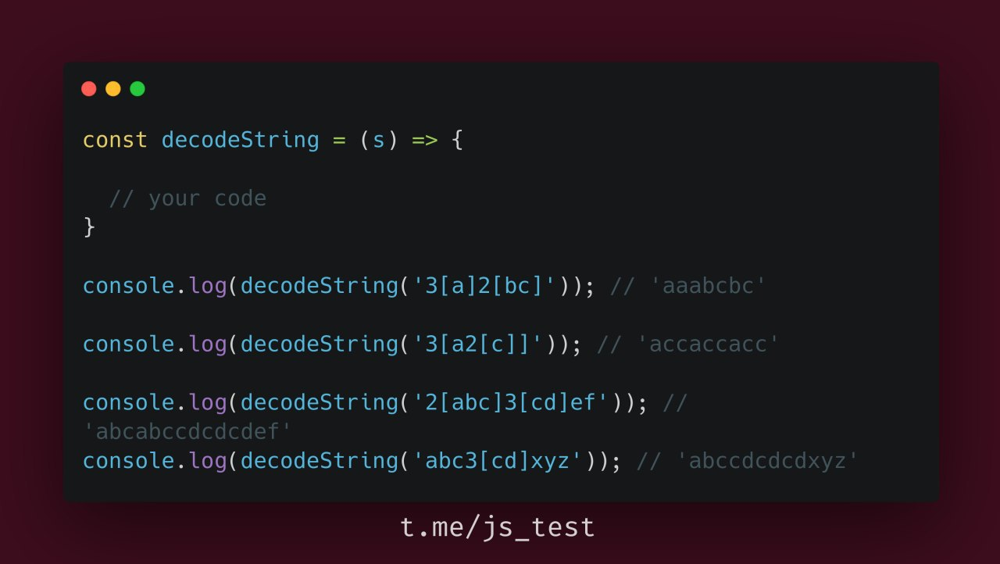

There is an archived string; it should be parsed and unarchived.



EBNF notation:

```
digit           = "0" | "1" | "2" | "3" | "4" | "5" | "6" | "7" | "8" | "9" ;
number          = digit, { digit } ;
word            = "a" | "b" | (* ... | *) "z" ;
sequence        = number, "[", whole_string, "]" ;
whole_string    = word | digit, { word | digit } ;
```
